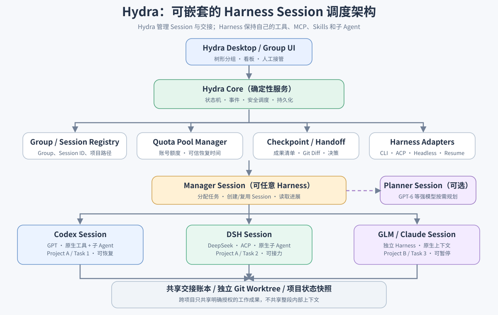
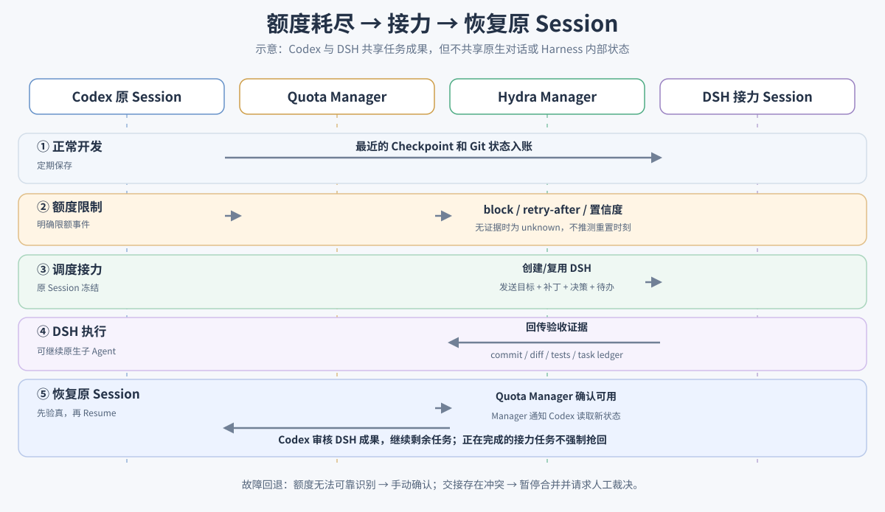
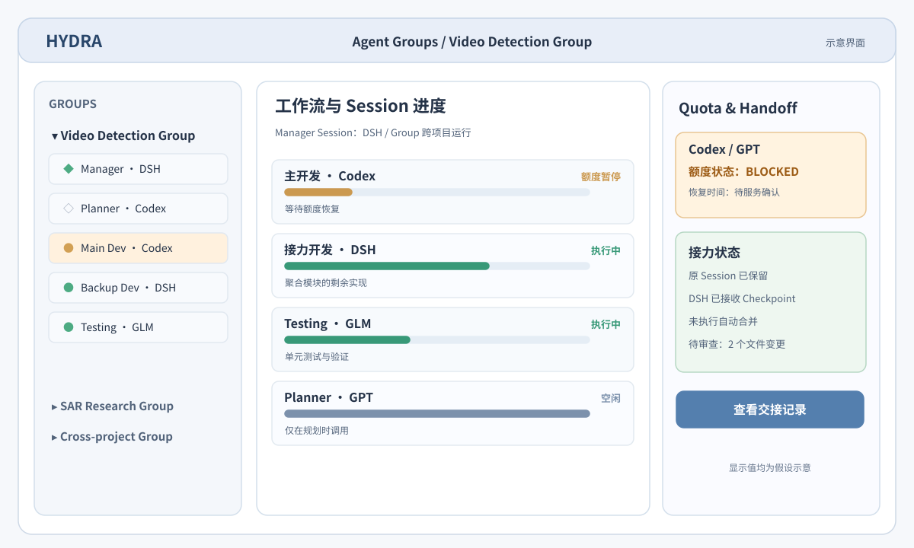

# Hydra：分层 Agent Group 与跨 Harness Session 接力改造计划

> 状态：**设计提案 / 尚未实施** · 日期：2026-10-09 · 目标平台：Windows 优先，兼顾 macOS/Linux  
> 计划范围：仅提交架构与视觉设计，不修改现有运行逻辑。  
> 原则：**Hydra 只在 Harness 之间调度完整 Session；不替代 Codex、DSH、Claude Code 或 OpenCode 自己的工具链、Skills、MCP、子 Agent 与会话上下文。**

## 0. 三张设计示意图

**架构总览**（点击查看可放大 SVG）：



**额度耗尽 → 接力 → 原会话恢复**：



**桌面端 Group 工作区草图（所有进度与额度均为假设数据，不是已实现页面）**：



## 1. 问题与目标

### 1.1 真实使用场景

- 一个 **Manager Session** 是 Codex / DSH / Claude / OpenCode 中任一完整 Harness Session，只负责分配、追踪和交接任务；它可以按需调用更强的 **Planner Session** 制定方向。
- 一个 **Worker Session** 是完整的 Harness 工程会话，保留原生上下文、工作目录、子 Agent、Skills 和工具使用方式；**不是**每次任务调用一次的无状态 LLM。
- Manager 可以选择 **沿用已有 Session** 或 **新开 Session**；同一 Session 可接收连续多个任务。
- 一个 Group 可包含多个项目的 Session；同一项目也可存在多个 Group；**Group != Project != Session != Task**。
- GPT 或 GLM 等服务额度池用尽时，保留原 Session 与尚未完成的工作；Manager 把适合接力的任务交给其他 Harness，随后在原额度池恢复时同步进展并继续原 Session。
- Manager 自身也会遇到额度不足：基础调度、状态记录、定时探测和安全规则由不依赖 LLM 的 Hydra Core 执行。

### 1.2 V1 要交付与不交付的内容

**要交付：**嵌套的 Group → Manager/Worker Session 展示；创建/关联/复用 Session；Session 归属与进度事件；手动标记额度限制；持久化 Checkpoint；人工确认的接力与恢复。

**不在 V1：**强行统一所有 Harness 的内部子 Agent API；跨 Harness 恢复同一原生 conversation；准确预测所有服务的额度；全天候常驻高成本 Manager 推理；任意文件的无人值守自动合并。

V2 引入可验证的额度事件/自动接力；V3 引入按能力和额度智能路由、多级 Group 与自动 Planner。

## 2. 先区分五种对象（避免 Session 被误当 Task）

| 对象 | 作用 | 关键约束 |
| --- | --- | --- |
| `ProjectRef` | 本地仓库目录 / worktree / 项目标识 | 项目路径和 Session 分开保存 |
| `AgentGroup` | 长期存在的逻辑容器，含 Manager 与成员 Session | 可跨项目；V1 每个 Session 只有一个**写入调度所有者** |
| `HarnessSession` | Provider 原生 Session ID、cwd、Provider、模型、生命周期 | 原生恢复，不复制内部状态到另一 Harness |
| `TaskAssignment` | 一个工作目标及其验收条件与当前承担的 Session | 一个 Session 可连续处理多个 Task |
| `QuotaPool` | 账号/订阅/产品额度池及其可信状态 | 多 Session 可能共享池；**不是**按 Session 分配额度 |

建议 V1 中 `AgentGroup.parentGroupId` 保留为可空字段，但不允许形成循环；真正的多层嵌套管理下放到 V3，以免早期引入父子调度冲突。

### 2.1 持久化数据草案

```ts
type SessionLifecycle =
  | "registered" | "starting" | "ready" | "busy"
  | "suspended" | "resume_pending" | "errored" | "unavailable";

type QuotaAvailability = "available" | "degraded" | "blocked" | "unknown";

interface AgentGroup {
  id: string;
  name: string;
  managerSessionId: string | null;
  sessionIds: string[];
  projectRefs: string[];       // 可跨项目
  parentGroupId: string | null;
  orchestrationPolicyId: string;
}

interface HarnessSession {
  id: string;                  // Hydra 内部稳定 ID
  provider: "claude" | "codex" | "opencode" | "dsh";
  nativeSessionId: string | null;
  cwd: string;                 // 需满足原生 resume 约束
  projectRef: string;
  groupId: string | null;
  role: "manager" | "planner" | "worker";
  quotaPoolId: string | null;
  lifecycle: SessionLifecycle;
  currentTaskId: string | null;
  checkpointId: string | null;
}

interface QuotaPool {
  id: string;                  // 稳定池标识；不存凭据
  provider: string;
  accountAlias: string;        // 不记录 Token、密码或 Cookie
  availability: QuotaAvailability;
  resetAt: string | null;      // 必须有依据；不能凭空假设 5 小时
  observedAt: string | null;
  source: "official" | "cli_signal" | "manual" | "estimated" | "unknown";
  confidence: "high" | "medium" | "low";
}

interface TaskAssignment {
  id: string;
  groupId: string;
  assigneeSessionId: string | null;
  goal: string;
  acceptanceCriteria: string[];
  state: "queued" | "assigned" | "active" | "blocked" | "handoff" | "review" | "done";
  artifacts: string[];
}

interface SessionCheckpoint {
  id: string;
  sessionId: string;
  taskId: string | null;
  completed: string[];
  nextSteps: string[];
  decisions: string[];
  gitBaseCommit: string | null;
  branch: string | null;
  dirtyPaths: string[];
  artifacts: string[];
  capturedAt: string;
}
```

**注意：**当前仓库的 `AgentStatus` 是进程状态，不能直接无限扩充为「进程 × Session × Task × Quota」所有组合。保持原进程状态兼容，新增独立的 Session、Task 与 Quota 状态及可追溯事件。

## 3. 技术架构与职责边界

### 3.1 Hydra Core：不依赖 LLM 的确定性服务

- `GroupManager`：Group/成员关系、跨项目索引、Manager 指派和成员权限。
- `SessionCoordinator`：已有 Session 选择、新建/恢复、占用检查、暂停派工、原生 Session ID + cwd 持久化。
- `TaskDispatcher`：任务队列、选择现有还是新开 Session、结果回执、状态和失败重试。
- `QuotaManager`：额度池归属、可信额度事件、恢复时间与探测、路由限制。
- `CheckpointManager` / `HandoffManager`：阶段性检查点、补丁/产物/决策交接、重新汇报给原 Session。
- `EventJournal`：基于事件更新页面和通知；Manager 按需读取，不通过高频轮询终端维持进度。

### 3.2 Manager Session 与 Planner Session

- **Manager** 是用户可选择 Harness 的普通可恢复 Session，借助 Hydra MCP 工具管理其 Group；默认不承担繁重实现任务。
- **Planner** 是按需由 Manager 请求的独立 Session（可为强模型），输出计划供 Manager 确认/执行；不拥有 Worker Session 的启动与暂停权限。
- **Worker** 继续使用其 Harness 原生工具与子 Agent；Hydra 只做 Session 外部控制。
- Manager 耗尽额度时，Hydra Core 仍可依据已经记录的规则执行暂停/恢复与通知；无法确定的新分工需等待可用 Manager 或人工确认。

### 3.3 Session 运行适配

Provider Adapter 至少具备能力发现与声明，例如：

```ts
interface SessionAdapterCapabilities {
  canStart: boolean;
  canResume: boolean;
  canGracefullySuspend: boolean;
  hasMachineReadableProgress: boolean;
  hasMachineReadableQuota: boolean;
  supportsNativeChildAgents: "native" | "none" | "unknown";
}
```

不要把 `kill` 当作所有 Provider 上都安全的 `pause`。可能的暂停策略是：停止新任务派发、记录快照、等待安全边界、再按 Provider 能力停止进程或让其空闲；**必须确认原生 Session 可恢复**。DSH 特别要处理写入句柄的独占释放与恢复时相同物理 `cwd`。

**隔离原则：**一个工作目录在同一时刻不得被两个写入 Agent 不受控地修改。若确需并行，优先 Git Worktree；交接时提供 commit / patch 与工作状态，而不是让新 Worker 直接覆盖原 Worker 的脏目录。

## 4. 额度事件处理与跨 Harness 接力

### 4.1 Quota Adapter 接口

```ts
interface QuotaObservation {
  poolId: string;
  availability: "available" | "degraded" | "blocked" | "unknown";
  resetAt?: string | null;
  source: "official" | "cli_signal" | "manual" | "estimated" | "unknown";
  confidence: "high" | "medium" | "low";
  rawCode?: string;
  observedAt: string;
}
```

**重要：**现有 `UsageDashboard` 的 token/cost 统计 **不是**剩余订阅额度，也不是稳定的恢复时间接口。V1 以手动标记 + 精确错误事件输入为基础；V2 才对接提供者允许且可靠的官方使用量接口。`429` 可能是临时速率限制、并发限制或额度耗尽，必须分类，不可等同为统一的 5 小时耗尽。`resetAt` 为空时不得展示虚构倒计时。

### 4.2 接力状态机

1. **Active**：原 Session 运行；按任务阶段落盘进度与代码状态（低频或重要事件触发）。
2. **Quota blocked**：只在有充足证据时冻结该额度池的新任务；原任务标记 blocked，不删除 Session。
3. **Checkpoint**：优先读取最近成功保存的检查点；如果额度已经用尽，**不得假定模型能再次自我总结**。补充 Git status、diff、测试结果、可安全读取的工具输出。
4. **Handoff**：Manager 选择新 Session / 已有空闲 Session，将目标、限制、完成情况、补丁位置、待办和验收条件交给接力 Harness；记录 `handoffId` 和版本基准。
5. **Continue**：接力 Session 独立执行、可调用原生子 Agent，定期报告可验证进展；不会尝试导入原 Harness 私有 Session 格式。
6. **Quota recovered**：到点只是「应重新探测」，不是直接认定恢复。确认可用、原生会话可被独占恢复后再 Resume。
7. **Sync back**：按 `handoffId` 将接力期间的 commits/diffs、已完成测试、接口变化、未完成任务和风险汇总回原 Session；原 Session 检视当前 workspace 后继续。
8. **No forced preemption**：已经接近完成的接力任务不强制从 DSH 抢回 Codex；新任务可回到 Codex。冲突需人工批准合并。

### 4.3 示例

- Codex A：视频检测模块主开发（原生 Session ID `c-001`），quota pool = `gpt-account-A`。
- DSH B：DeepSeek 接力实施（原生 Session ID `d-002`），quota pool = `deepseek-account-B`。
- Planner C：临时 GPT 规划，正常情况下不常驻消耗额度。
- 当 Codex A 限额，Hydra 保存 `c-001`，把可独立实施的剩余任务交给 `d-002`。
- 当 GPT 额度真正恢复，`c-001` **原生 Resume** 并收到 `d-002` 的进展，继续工程，不是重新创建一个「新的 Codex 代理」。

## 5. 结构化进展，而不只依赖 PTY 文本

建议事件流（可存 JSONL / SQLite；根据现有配置存储选型确认）：

```text
group.created
session.registered
session.started
session.waiting
task.assigned
task.progress_reported
task.blocked
quota.observed
quota.blocked
checkpoint.created
handoff.requested
handoff.accepted
handoff.completed
quota.recovered
session.resumed
task.review_requested
```

每条事件都有 `eventId`、`groupId`、`sessionId`、`taskId`（可空）、`occurredAt`、`source`、`evidence`。幂等键与顺序号避免重启后重复接力。当前 `agent_waiting`（终端停止输出）仅代表**可能等待输入**，不能认定 Task 完成或额度耗尽。

Manager 查询的是「最近 Checkpoint + 已确认任务事件 + 近期必要的终端片段」，不做全量 transcript 互拷，也不要求获取任何模型的私有思考内容。

## 6. 对当前 Hydra 仓库的具体改动位置

| 当前文件/目录 | 已有能力 | 增量改造 |
| --- | --- | --- |
| `shared/types.ts` | Provider、AgentConfig、AgentStatus、WorkMode | 新增 Group、QuotaPool、Checkpoint、Task、Handoff 类型；兼容旧持久化 |
| `electron/agents/AgentManager.ts` | PTY、Session ID、启动/重启/工作树、agent_waiting | 提供显式状态事件/暂停边界；不要改变原 CLI 会话执行 |
| `electron/agents/providers.ts` | Claude/Codex/OpenCode/DSH 的 CLI/ACP Spawn | 加 Adapter 能力声明，区分暂停、Resume、Headless 与错误类型 |
| `electron/agents/dsh/acpClient.ts` + `electron/agents/dsh/bridge.ts` | DSH ACP new/resume + 桥接 | 确保写句柄释放；可选暴露可用的管理 MCP；不强求 DSH 内部接管其它 Harness |
| `electron/headless/HeadlessOrchestrator.ts` | 一次性后台 Run | 保留执行能力，增加可关联 Task/Handoff 的回执 |
| `electron/mcp/McpServer.ts` | 列出/新建/发送/读取/停止/重启 Agent | 暴露安全的 Group/Session/Quota/Handoff 工具 |
| `electron/mcp/manager-workspace.ts` | 为 Manager 写入 Hydra MCP 和 CLAUDE.md | 抽象为跨 Harness 管理指令与配置；不要求固定 Claude |
| `electron/daemon/DaemonServer.ts` + `electron/ipc/handlers.ts` | daemon、IPC 服务入口 | 新增分组状态、任务事件与管理 API |
| `src/components/Sidebar/` + `src/components/` | 项目列表、Agent 视图、通知 | Group 树、配额面板、接力卡片、进度列表 |

建议新增：

```text
electron/
  orchestration/
    GroupManager.ts
    SessionCoordinator.ts
    TaskDispatcher.ts
    CheckpointManager.ts
    HandoffManager.ts
    EventJournal.ts
  quota/
    QuotaManager.ts
    adapters/
      CodexQuotaAdapter.ts
      DshQuotaAdapter.ts
      GlmQuotaAdapter.ts
src/
  components/
    AgentGroups/
    QuotaPanel/
    HandoffPanel/
```

名称为建议，实施时以已有 daemon / stores 的工程结构为准，避免重复的状态源。

## 7. 拟新增的调度 MCP 工具

| 工具 | 行为 |
| --- | --- |
| `hydra_group_create` / `hydra_group_add_session` | 创建 Group、把新/现有 Session 关联进去 |
| `hydra_group_get_state` | 返回每个 Worker 的任务/额度/检查点摘要 |
| `hydra_session_start_or_reuse` | 明确选择既有 Session 或创建新 Session（不能无条件创建） |
| `hydra_session_suspend` / `hydra_session_resume` | 遵循 Provider 原生能力及锁定约束 |
| `hydra_task_assign` / `hydra_task_report` | 结构化分派及可验收的进展回执 |
| `hydra_quota_get_status` / `hydra_quota_mark_blocked` | 查看有来源的额度池状态；人工/可信信号输入 |
| `hydra_checkpoint_capture` | 保存任务状态 + 安全 Git 元数据 |
| `hydra_handoff_prepare` / `hydra_handoff_accept` | 生成/接收接力材料；回传成果并审查 |

权限边界：只允许 Manager 调度其 Group 的成员；Worker 的原生子 Agent 不自动获得全局 Manager 权限；敏感操作（跨组文件写入、合并、提权、删除）默认要求明确审批。沿用 Hydra 现有 YOLO 选项，但**不**把全局 YOLO 自动启用作为调度前提。

## 8. 开发阶段、验收标准

### P0 / V1：可工作的分组、Session 与人工交接

- Group 数据持久化，重启后可恢复关联，不丢失原生 Session ID、cwd 与项目归属。
- Group 界面能显示 Manager/Planner/Worker、工作项目、当前 Task 和手动额度标记。
- Manager 能在同一 Group 中分别复用 Codex Session、创建 DSH Session 并返回明确分派记录。
- 手动暂停一个 Session 后，该额度池不可派发新任务；可查看并准备 Checkpoint。
- 可以把该 Task 转交给另一个 Harness；恢复原 Session 后发送带证据的进展摘要。
- 不允许两个写入 Worker 默默覆盖相同工作目录；冲突可见且可阻断。

### P1 / V2：自动额度事件与可验证的恢复

- Quota Adapter 可返回 `available / blocked / degraded / unknown` 与数据来源、可信度；无恢复时间时 UI 显示未知。
- 额度错误、普通 429、网络故障、进程崩溃在测试中区分，不误判。
- 周期性重新确认额度；探测失败有限退避，不高频调用模型烧额度。
- 自动冻结派工、保存可获得的 Checkpoint、通知 Manager、候选接力、恢复后进展同步。
- Manager 额度耗尽时，Hydra Core 规则还能保存事件、暂停、探测和通知。

### P2 / V3：智能规划与多级编排

- 可选 Planner（例如强模型）提出方向、分工与任务依赖，Manager 确认并执行。
- 根据模型/工具能力、会话现有上下文、额度与任务依赖选择 Harness，而不固定「一个模型=一个角色」。
- 多层 Group 的循环与竞争写入检测、分层权限和预算警戒。

### 最低自动测试集合

1. 创建 Group、关联跨项目两种 Provider Session，重启 daemon 后不丢成员关系。
2. Manager 给已有 Session 派第二个 Task，不触发新 Session。
3. 手动标记 Codex 额度 blocked，保留 nativeSessionId / cwd / branch / checkpoint。
4. DSH 获取接力材料，不能直接占用仍由原 DSH 进程持有的相同 Session。
5. Quota 变为 unknown / 普通 429 不触发假定 5 小时重置。
6. 额度恢复后只在 Provider 校验通过时 Resume 原 Session，并同步接力变更。
7. 使用独立 Worktrees 的并行任务可以提交 review；dirty workspace 冲突阻断自动合并。
8. 两次重复 handoff / resume 事件不会启动双进程或重复写入。
9. Manager 停止服务后，Group 事件仍能持久化，重启可重建。
10. Windows 下退出 DSH Bridge 后不遗留 ACP 孤儿进程/写入句柄；macOS/Linux 兼容已有 PTY。

### 交付拆分建议

- PR-A：类型、存储、迁移与 Group UI（不接自动额度）。
- PR-B：SessionCoordinator、MCP tools、可控暂停/Resume 与手动 Handoff。
- PR-C：Quota Adapter、可信事件分类、自动接力、恢复探测。
- PR-D：Planner、智能路由、跨层级 Group 与增强可视化。

每个 PR 都要独立通过 `npm run typecheck`、`npm test` 和相关平台烟测；现有 Agent 执行行为和老用户工作区应保持兼容。

## 9. 风险与设计决定

| 风险 | 防护 |
| --- | --- |
| Provider 额度信息不公开、非机器可读 | unknown + 手动标记 + 可信来源，不伪造用量与恢复时间 |
| 额度突发耗尽，来不及主动总结 | 阶段性 Checkpoint + Git/文件证据，不依赖最后一次 LLM 回答 |
| DSH Session 独占锁 | 停止原桥接进程并确认句柄释放，cwd 一致才 Resume |
| 两个 Harness 同写一个工作目录 | Worktree 隔离/单写者；自动合并关闭，优先人工审查 |
| 账号额度与 Session 不一一对应 | QuotaPool 绑定账号/订阅作用域而非 Session |
| Manager 自身没有额度 | Hydra Core 持有不可变的状态、定时检查和通知；需要判断时等待 Manager 或人工 |
| 跨项目泄露凭据/敏感信息 | 显式工作区授权、交接材料最小化、Secrets 脱敏、无令牌同步 |
| 重启后重复派工 | EventJournal + 幂等键 + Session 所有权校验 |
| 不同 Harness 协议不一致 | Provider 能力声明 + 适配器；无法实现则降级为手动交接 |

## 10. 待确认的产品选择（不阻塞 V1 原型）

1. 一个已有 Session 是否允许同时作为多个 Group 的成员？**建议 V1 单一写入调度所有权，其他 Group 仅可只读引用**。
2. Manager 是否必须常驻运行？**建议否**：Hydra Core 管理生命周期，Manager 按需启动/恢复。
3. 接力阶段能否自动合并代码？**建议默认否**：先报告 Diff 和测试证据，再由原 Session 或用户审查。
4. Quota Adapter 是否依赖某种 Web 页面抓取？**建议否**：优先官方与稳定接口；不可用即 unknown/手动。
5. Manager 能否直接调度 Worker 的内部子 Agent？**建议不需要**：原生 Harness 自行完成内部层级调度。

---

**完成判据（产品层面）：**用户能够在 Hydra 打开一个 Group，让 DSH Manager 同时管理可恢复的 Codex、DSH、GLM Session；当 Codex/GLM 额度池不可用时不会丢掉原 Session，其他 Harness 能根据有证据的工作快照继续任务；额度恢复后原 Session 得到跨 Harness 的成果汇报并继续，而不被悄悄替换为一个新 Session。
